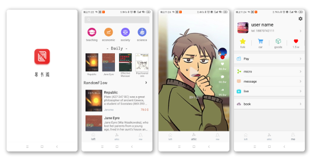

 易书阁
======

 一款基于短视频的书籍交易app

[toc]


需求
----

直播：用来做书籍的发布和宣讲

短视频：书籍的段篇章的介绍，这里可以叫编辑，绘画出一些书籍来进行宣传

两者之间的差别就是时间，可以很好的缩短介绍。

书籍类别的展示

个人页面的展示：基础的信息，购物车，支付方式


架构与实现
----------

### View

#### 页面制作

##### 需要考虑的问题

前端页面的制作，主要是四方面：

- 页面素材：页面样式，页面色彩，页面图标
- Theme与Style：抽象，沉浸式，输入法模式
- 基类View以及页面碎片化组合：（Fragment，ViewStub，include，merge)，BaseFragment，BaseActivity
- 自定义View


##### 第三方库

```java
// view 库
implementation "com.jakewharton:butterknife:$rootProject.ext.butterknifeVersion"
annotationProcessor "com.jakewharton:butterknifecompiler:$rootProject.ext.butterknifeCompilerVesion"
implementation "com.android.support:recyclerview-v7:$rootProject.ext.supportVersion"
implementation "com.android.support:design:$rootProject.ext.supportVersion"
//noinspection GradleDependency
implementation "de.hdodenhof:circleimageview:$rootProject.ext.circleimageviewVersion"
implementation "com.makeramen:roundedimageview:$rootProject.ext.roundedimageviewVersion"
// 下拉库
implementation "com.cjj.materialrefeshlayout:library:$rootProject.ext.refeshlayoutVersion"
```


#### 主界面展示



#### 知识储备

// TODO 

- [Butterknife原理]() 
- [圆角与圆形的原理以及库]() 
- [Fragment切换封装]() 
- [Android工具类集合：Bar,Sceren]() 
- [RecycleView原理与封装]() 
- [下拉水文库的原理]()
- [drawable：画边框, 阴影, 圆角]()


### Presenter


### Model


### Net


