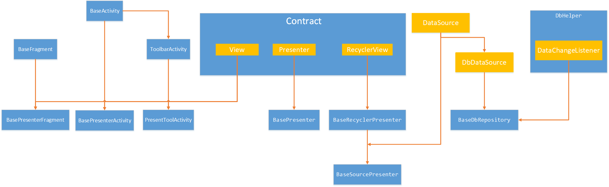

 易书阁
======

 一款基于短视频的书籍交易app

[toc]

需求分析
----

直播：用来做书籍的发布和宣讲

短视频：书籍的段篇章的介绍，这里可以叫编辑，绘画出一些书籍来进行宣传

两者之间的差别就是时间，可以很好的缩短介绍。

书籍类别的展示

个人页面的展示：基础的信息，购物车，支付方式


架构与实现
----------

### 整体说明

这个APP是以MVP的方式组建，MVP是解决耦合度问题，是的条理清晰。

整个APP分为四个包：app，factory，data，common，负责MVP的不同角色

> app -> View , factory -> Presenter，data -> Model

- app：需求定制与美化、页面碎片化与样式抽象化、页面路由与通信、操作锚点与反馈展示

  > 页面碎片化以及样式抽象化：主要是为了View的复用，以及样式的复用

- factory：MVP协议制定，前端数据检测，前端数据打包，前端数据引流，操作反馈

  > 数据引流：是为了复用model操作的API，将很多相似操作集合，达到复用
  >
  > 操作反馈：正误信息的反馈，正确信息包括两个操作：**后台数据缓存，页面数据更新**

- data：数据汇聚，数据持久化，数据本地化，数据网络化，数据分发

  > 数据汇聚：前端页面收集数据，由presenter检测，汇聚到DataHpler中
  >
  > 数据分发：涉及观察者模式，当DbHelper接收到变化的数据的时候，根据数据的类型进行分发，通知对应的presenter缓存更新以及页面数据更新

- common：工具类，基类搭建，基础协议，自定义View，文件操作

  > 工具类：网络状况，屏幕适配以及修改，集合转换，前端数据检测，格式化时间，数据加密，消息通知
  >
  > 文件操作：主要是用于缓存头像文件，以及裁剪的图片的文件


### 基类架构

#### 图描述



#### MVP的搭建

- Contract 定义了标准基础的View，Presenter，RecycleView的协议

- BaseActivity、BaseFragment、ToolbarActivity都是抽象类

  抽象定义一些View常见的方法，同时也是作为所有View的一个总体控制

- BasePresenterActivity、BasePresenterFragment、PresentToolActivity都是抽象类

  操作锚点与反馈展示的通常实现，，以及一些都必须实现的是，比如：showDialog

- BasePresenter、BaseRecyclerPresenter、RecyclerSourcePresenter、SourcePresenter

  操作反馈基本操作的实现，因为大部分数据都是用RecycleView来进行展示的，所以针对Recycle的操作反馈做了基础的封装。RecyclerSourcePresenter与SourcePresenter是当factory有缓存的时候配合使用的封装。


**具体说一下VIew与Presenter绑定方式**：

BaseContract/BasePresenter：

基础协议要求通过泛型来限定VIew中的Presenter，同时要求Presenter在对象建立的时候与View相互绑定

```java
public interface BaseContract {
    interface View<T extends Presenter> {
        void showError(@StringRes int error);
        void setPresenter(T present);
        void showDialog();
        Activity getActivity();
    }
    interface Presenter {
        void start();
        void destroy();
    }
    interface RecyclerView<T extends Presenter, ViewMode> extends View<T> {
        RecyclerAdapter<ViewMode> getRecyclerAdapter();
        void onAdapterDataChanged();
    }
}
public class BasePresenter<T extends BaseContract.View> implements BaseContract.Presenter {
    public T mView;
    public BasePresenter(T view) {
        setView(view);
    }
    public void setView(T view){
        this.mView = view;
        this.mView.setPresenter(this);
    }
    public T getView(){
        return this.mView;
    }
    @Override
    public void start() {
        T view = mView;
        if (view != null) {
            view.showDialog();
        }
    }
    @Override
    public void destroy() {}
}
```


#### 数据基类架构

主要是围绕着：数据汇聚，数据持久化，数据本地化，数据网络化，数据分发

- 数据持久化：主要是Account静态类的建立，在SharePreference中保存

- 数据本地化和数据网络化

  本地化的数据不一定需要加载到网络，可以是其他页面操作的记录，比如说购物车的业务，可能是由View或者网络数据推送的数据，需要相关页面作出更新，则需要构建观察者模式。

- 数据汇聚：主要是前端页面发出的请求可能类似或者说相同，在data目录中建立DataHelper来进行数据汇聚

- 数据分发：主要是观察者模式的分发，以及后台推送的数据是未知的所以也需要进行一个分发。

所以基类的架构主要是：

观察者模式的搭建，汇聚与分发的搭建，网络接口回调搭建，本地数据库的建立，网络接口的建立。


##### 观察者模式搭建

观察者模式，或者叫发布订阅者模式。

这里是通过：DBHelper与BaseDbRepository来建立观察者模式

**Dbhelper**：单例模式，充当发布订阅者中的，平台角色也是发布者，主要是处理三件事：

1. 提供数据的订阅的方法，以及相应的移除

2. 本地数据操作的集合，并通知订阅者相关的数据到来与改变

3. 建立数据的变化的回调，要求**BaseDbRepository**必须实现

   ```java
   interface DataChangeListener<Data extends BaseModel> {
       void onDataSave(Data... list);
       void onDataDelete(Data... list);
   }
   ```

**BaseDbRepository**：抽象类，DbHelper是相应的为订阅者，所有的子类都会默认三件事：

1. 建立发布订阅者模式：订阅的类型，数据加载之前在**DBHelper**中进行注册
2. 建立数据的缓存：LinkList，同时提供数据的在缓存中的更新
3. 在presenter调用的时候


##### 数据汇聚与分发

// todo 后续IM开发的时候完成


##### 数据回调接口

DataSource：定义了数据 加载的阶段 统一接口，这里用于网络加载数据的回调

```java
public interface DataSource  {
    // 成功或者失败都具有
    interface Callback<T> extends SucceedCallback<T>, FailedCallback {}
    // 获取成功
    interface SucceedCallback<T> { void onDataLoaded(T t);}
    // 获取失败
    interface FailedCallback { void onDataNotAvailable(@StringRes int strRes);}
    // 数据销毁
    void dispose();
}
```

DbDataSource：定义从数据库中加载数据，通常用于BaseDbRepository本地数据load。

```java
public interface DbDataSource<Data> extends DataSource {
    void load(SucceedCallback<List<Data>> callback);
}
```


### 页面实现

#### 页面制作

需要考虑的问题

前端页面的制作，主要是四方面：

- 页面素材：页面样式，页面色彩，页面图标
- Theme与Style：抽象，沉浸式，输入法模式
- 基类View以及页面碎片化组合：（Fragment，ViewStub，include，merge)，BaseFragment，BaseActivity
- 自定义View

// todo 说清楚，碎片化了哪些界面

#### 主界面展示


#### 知识储备

// TODO 

- [Butterknife原理]() 
- [圆角与圆形的原理以及库]() 
- [Fragment切换封装]() 
- [Android工具类集合：Bar,Sceren]() 
- [RecycleView原理与封装]() 
- [下拉水文库的原理]()
- [drawable：画边框, 阴影, 圆角]()


### 逻辑实现

#### 基础实现

##### 多线程/IO

建立一个以大小为4的线程池。

```kotlin
class Factory {
    companion object {
        private var executor = Executors.newFixedThreadPool(4)!!
        init {
            executor = Executors.newFixedThreadPool(4)
        }

        fun runOnAsync(runnable: Runnable) {
            executor.submit(runnable)
        }
    }
}
```


##### 本地数据

建立图片缓存位置，建立本地数据库，建立观察者模型数据通知。

```kotlin
open class Application : android.app.Application() {
    companion object {
        lateinit var instance: Application
        private fun getCacheDirFile(): File {
            return instance.cacheDir
        }
        fun getAvatarTmpFile(): File {
            val dir = File(getCacheDirFile(), "avatar")
            dir.mkdir()
            val files = dir.listFiles()
            if (files != null && files.isNotEmpty())
                for (file in files) file.delete()
            return File(dir, SystemClock.uptimeMillis().toString() + ".jpg").absoluteFile
        }
        fun showToast(activity: Activity, msg: String?) {
            activity.runOnUiThread {
                Toast.makeText(instance, msg, Toast.LENGTH_LONG).show() }
        }

        fun showToast(activity: Activity, @StringRes msgId: Int) {
            showToast(activity, instance.getString(msgId))
        }
    }
    override fun onCreate() {
        super.onCreate()
        instance = this
    }
}
```

本地数据库的建立，引用的是dbflow，要注意的是导入第三库数据表和数据表类必须在同一个包


##### 网络数据/本地数据库

```kotlin
class DataKit {
    companion object {
        private val gson: Gson = GsonBuilder() // 设置时间格式
                .setDateFormat("yyyy-MM-dd'T'HH:mm:ss")
                .setExclusionStrategies(DBFlowExclusionStrategy())
                .create()
        var instance: DataKit? = null
            get() {
                if (field == null) field = DataKit()
                return field
            }
        fun app(): Application {
            return Application.instance
        }

        fun initDb() {
            FlowManager.init(FlowConfig.Builder(app())
                    .openDatabasesOnInit(true) // 数据库初始化的时候就开始打开
                    .build())
            FlowLog.setMinimumLoggingLevel(FlowLog.Level.V)
            if (Account.isLogin(app()))
                Account.load(app())
            // fixme just for local test
            StaticData.getBook(app())

        }

        fun getGson(): Gson {
            return gson
        }
    }
}
```


#### 用户信息系统

##### 页面展示


用户信息分两种：foker，self

当需要用户进行信息交互的时候，进行判断是否登入？

建立统一的个人账户管理类：Account

- 获取并保存，当前用户对象以及信息
- 记录登入状态

登入注册在同一个Activity中，提交按钮是同一个，所以要分发控制。

mine页面通过厂库实时更新

Register网络请求参数接口：

```json
{
	"avatarPath": "https://club.crabglory.www.etcb/cache/avatar/9193918.jpg",
	"name": "kevin",
	"password": "lkk23888",
	"phone": "18870742138"
}
```

Login

电话号码登入：

```json
{
	"code": "lkkzbl123888",
	"flag": false,
	"phone": "18870742138"
}
```

验证码登入：

验证码请求发送：

```
{

}
```


```json
{
	"code": "0909",
	"flag": true,
	"phone": "18870742138"
}
```


#### 书籍购买系统


要考虑用户的书籍被卖之后，如何获取应有的钱。

当书籍被卖完，我们要进行刷新界面。

对于主界面的书籍的展示，`主要是设定两个条件：

- 类型：Random，type的区别
- 数量：到0则不展示

书籍购买流程：是从一本书成为一个商品的过程，当其购买完成，就成为一个goods

主界面书籍展示和类别界面展示，都进入一个购买窗口，全局唯一：ShopActivity

进行购物车操作和PAY

可以输入字符添加购物车，注意两个条件：

- 第一当前购买数量不能大于商品数量
- 假设购物车原有当前书籍，两者的数量不能大于商品数量
- 购物车操作，不进联网请求


#### 即时通信系统

好友与聊天


#### 视频引流系统


后台搭建与测试
--------------

