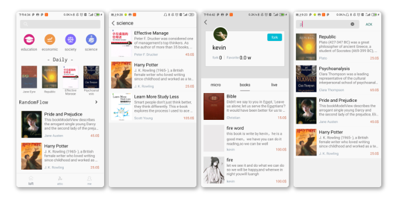
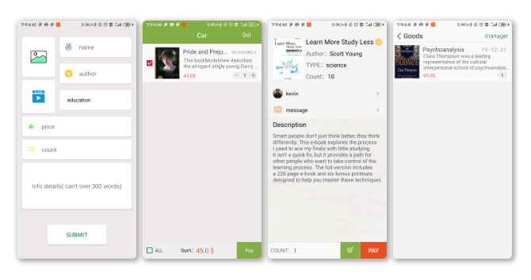
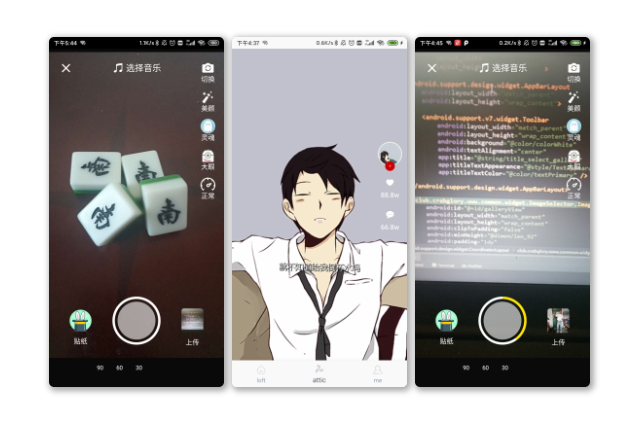
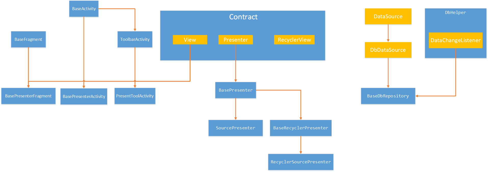

界面展示
--------

### 主界面

### 用户系统

### 书籍购买系统

### 即时通信系统

### 音视频系统

架构与实现
----------

### 整体说明

这个APP是以MVP的方式组建，MVP是解决耦合度问题，是的条理清晰。

整个APP分为四个包：app，factory，data，common，负责MVP的不同角色

app -> View , factory -> Presenter，data -> Model

- app：需求定制与美化、页面碎片化与样式抽象化、页面路由与通信、操作锚点与反馈展示

  > 页面碎片化以及样式抽象化：主要是为了View的复用，以及样式的复用

- factory：MVP协议制定，前端数据检测，前端数据打包，前端数据引流，操作反馈

  > 数据引流：是为了复用model操作的API，将很多相似操作集合，达到复用
  >
  > 操作反馈：正误信息的反馈，正确信息包括两个操作：**后台数据缓存，页面数据更新**

- data：数据汇聚，数据持久化，数据本地化，数据网络化，数据分发

  > 数据汇聚：前端页面收集数据，由presenter检测，汇聚到DataHpler中
  >
  > 数据分发：涉及观察者模式，当DbHelper接收到变化的数据的时候，根据数据的类型进行分发，通知对应的presenter缓存更新以及页面数据更新

- common：工具类，基类搭建，基础协议，自定义View，文件操作

  > 工具类：网络状况，屏幕适配以及修改，集合转换，前端数据检测，格式化时间，数据加密，消息通知
  >
  > 文件操作：主要是用于缓存头像文件，以及裁剪的图片的文件

### 基类架构

#### 图描述

#### MVP的搭建

- Contract 定义了标准基础的View，Presenter，RecycleView的协议

- BaseActivity、BaseFragment、ToolbarActivity都是抽象类

  抽象定义一些View常见的方法，同时也是作为所有View的一个总体控制

- BasePresenterActivity、BasePresenterFragment、PresentToolActivity都是抽象类

  操作锚点与反馈展示的通常实现，，以及一些都必须实现的是，比如：showDialog

- BasePresenter、BaseRecyclerPresenter、RecyclerSourcePresenter、SourcePresenter

  操作反馈基本操作的实现，因为大部分数据都是用RecycleView来进行展示的，所以针对Recycle的操作反馈做了基础的封装。RecyclerSourcePresenter与SourcePresenter是当factory有缓存的时候配合使用的封装。

#### 数据基类架构

主要是围绕着：数据汇聚，数据持久化，数据本地化，数据网络化，数据分发

- 数据持久化：主要是Account静态类的建立，在SharePreference中保存

- 数据本地化和数据网络化

  本地化的数据不一定需要加载到网络，可以是其他页面操作的记录，比如说购物车的业务，可能是由View或者网络数据推送的数据，需要相关页面作出更新，则需要构建观察者模式。

- 数据汇聚：主要是前端页面发出的请求可能类似或者说相同，在data目录中建立DataHelper来进行数据汇聚

- 数据分发：主要是观察者模式的分发，以及后台推送的数据是未知的所以也需要进行一个分发。

所以基类的架构主要是：

观察者模式的搭建，汇聚与分发的搭建，网络接口回调搭建，本地数据库的建立，网络接口的建立。